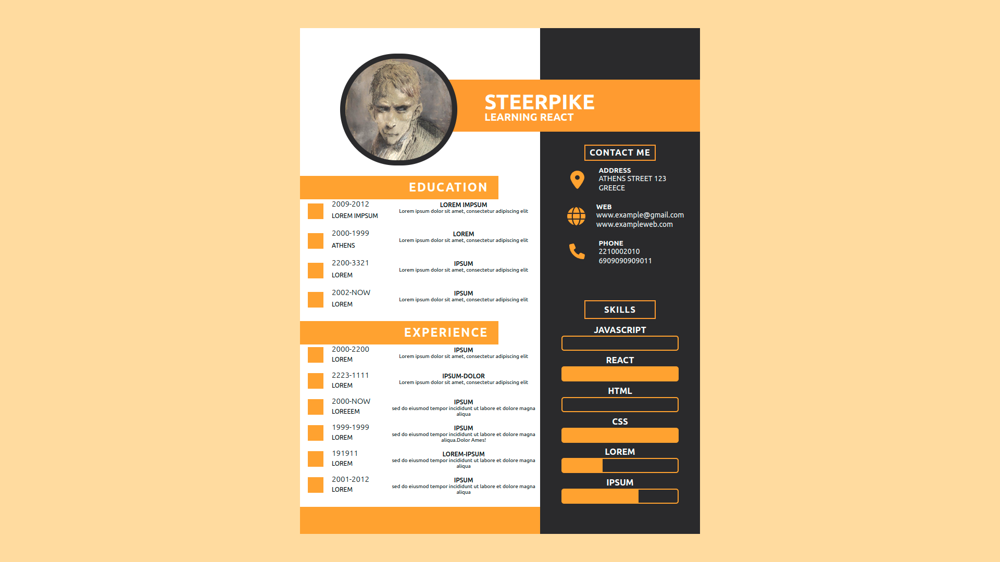

# Getting Started with Create React App

This project was bootstrapped with [Create React App](https://github.com/facebook/create-react-app).

# About

An application that allows the user to create a custom CV . The user can navigate the interface by hovering over each field and clicking on the corresponding buttons to initiate edits.

--> <a href="https://kiwasthal.github.io/cv-project/"> Application link <--

# Notes

Prevelant console bug was : multiple cases of styled-components initiated, with no apparent fix. Also , using styled component's library's functions really was taking a toll on visual code for no reason. Further study needed in the intricacies of styled component compositional arrangement. This project also uses <a href="https://fontawesome.com/"> Font Awsome </a> for simple design icons.
